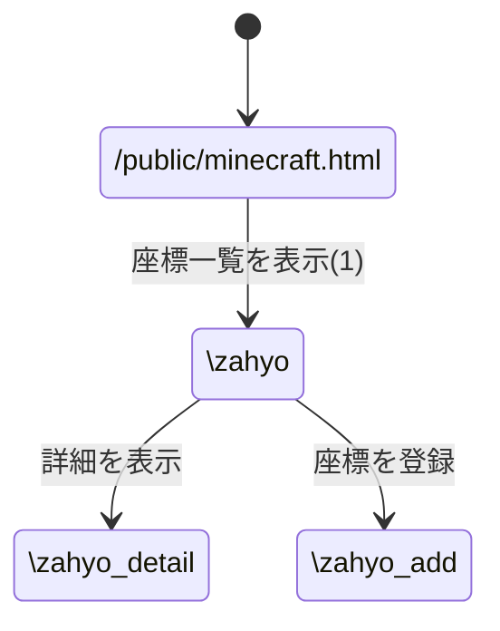
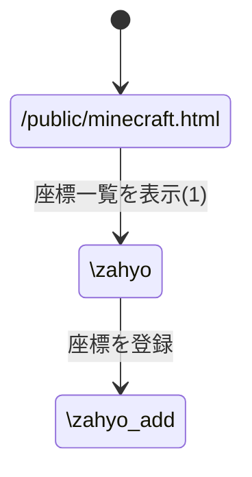

# レポート課題のページ遷移

### 1. Minecraft座標登録
#### ページ遷移図

#### (1)のパラメータ

パラメータ名 | 属性 | 内容 |
-|-|-
name | text | 名前 
x | number | x座標 
y | number | y座標 
z | number | z座標 

### 2. aaa
#### ページ遷移図

#### (1)のパラメータ

パラメータ名 | 属性 | 内容 |
-|-|-
name | text | 名前 
x | number | x座標 
y | number | y座標 
z | number | z座標 