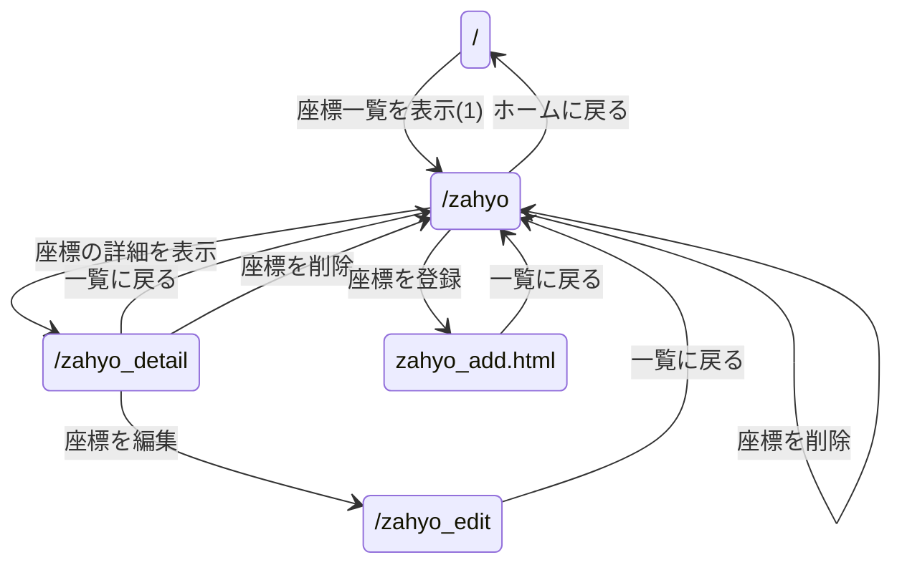
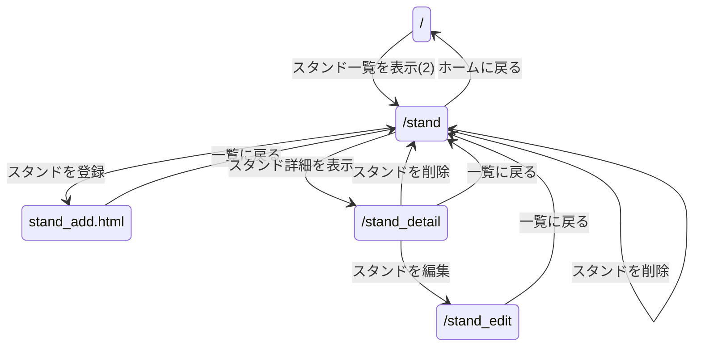
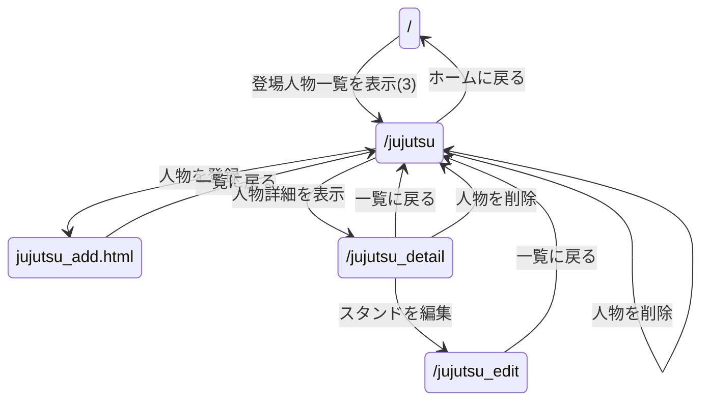

# レポート課題のページ遷移

### 1. Minecraft座標登録
#### ページ遷移図

#### (1)のパラメータ

パラメータ名 | 属性 | 内容 |
-|-|-
id | number | id
name | text | 名前 
x | number | X座標 
y | number | Y座標 
z | number | Z座標 

### 2. ジョジョの奇妙な冒険 スターダストクルセイダース スタンド
#### ページ遷移図

#### (2)のパラメータ

パラメータ名 | 属性 | 内容 |
-|-|-
id | number | id
name | text | スタンド名
name2 | text | 本体
dpower | radio | 破壊力
speed | radio | スピード
range | radio | 射程距離
persistance | radio | 持続力
precision | radio | 精密動作性
dpotential | radio | 成長性

### 3. 呪術廻戦 登場人物
### ページ遷移図

#### (3)のパラメータ

パラメータ名 | 属性 | 内容 |
-|-|-
id | number | id
name | text | スタンド名
rank | radio | 階級
jutsushiki | text | 術式名
ryoiki | text | 領域名
